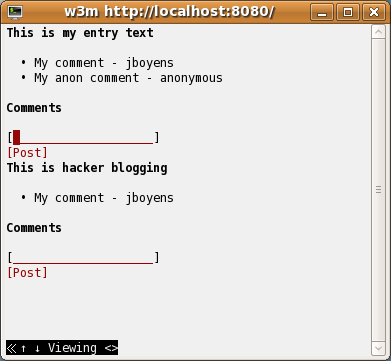

# Getting Started

1. Install [simple-build-tool](http://code.google.com/p/simple-build-tool) using
   the instructions at <http://code.google.com/p/simple-build-tool/wiki/Setup>.

   The short version, for Unix-like operating systems with Java
   already installed, is:

        mkdir -p ~/bin
        curl -o ~/bin/sbt-launch.jar http://simple-build-tool.googlecode.com/files/sbt-launch-0.7.4.jar
        echo 'java -Xmx512M -jar `dirname $0`/sbt-launch.jar "$@"' > ~/bin/sbt
        chmod 755 ~/bin/sbt

2. Grab the code from GitHub:

        git clone http://github.com/jboyens/BlogIn10Minutes.git

3. Download the dependencies and fire up the blog:

        cd BlogIn10Minutes
        sbt
        update
        jetty-run

4. Point your favorite browser to <http://localhost:8080/>:

        w3m http://localhost:8080/

   

   What?  w3m isn't your favorite browser!?
